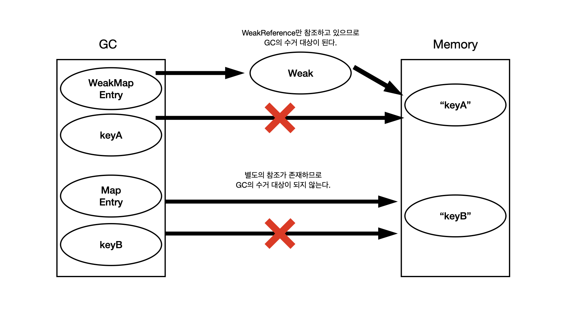

# 참조 종류와 GC 동작

## 강한 참조

- new 할당 후 새로운 객체를 만들어 해당 객체를 참조하는 방식
- 참조가 해제되지 않는 이상 GC의 대상이 되지 않습니다.

```java
MyClass obj = new MyClass();

// 중략

// 해당 메모리에 대한 참조가 해제
obj = null;

// 별도의 참조가 존재하지 않으면 GC에 의해 힙 영역에서 메모리 해제
```

## 약한 참조

```java
Integer target = 1;
WeakReference<Integer> weak = new WeakReference<Integer>(target);
```

- 약한 참조는 `WeakReference` Class를 이용해서 생성 가능
- 해당 객체를 가리키고 있는 참조가 `WeakReference`만 존재하는 경우 `GC`의 수거 대상이 됩니다.
- GC 메모리 부족 여부와 상관없이 무조건 제거됩니다.



## 소프트 참조

강한 참조와 약한 참조 사이 소프트 참조라는 것도 존재합니다.

```java
Integer target = 1;
SoftReference<Integer> soft = new SoftReference<Integer>(target);
```

- 소프트 참조는 `SoftReference` Class를 이용해서 생성 가능
- 해당 객체를 가리키고 있는 참조가 `SoftReference`만 존재하는 경우 `GC`의 수거 대상이 됩니다.
    - 단, JVM의 힙 영역의 메모리가 부족한 경우에만 제거되고 메모리가 부족하지 않은 경우 제거되지 않습니다.